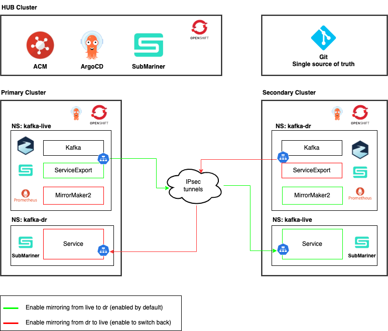

# Strimzi Disaster Recovery - PoC

The purpose of this repository is to test switch procedures from the primary kafka cluster to the secondary kafka cluster, simulating the disaster case, and the return from the secondary to the primary.

This is done by configuring two kafka clusters via Strimzi operator, running on two separate OpenShift clusters, connected via Submariner and managed by Red Hat ACM (Advanced Cluster Management) and ArgoCD in GitOps mode. 

The two kafka clusters are called `live` (as primary cluster) and `dr` (as secondary cluster), mirrored by MirrorMaker2 which is configured in active/passive mode with the replication policy `IdentityReplicationPolicy`.

## Architecture



# Setup

## Login OCP clusters

Login into OpenShift cluster hub:
```bash
KUBECONFIG=~/.kube/config_hub oc login --token=<token> --server=<url_api>
```

Login into OpenShift cluster live:
```bash
KUBECONFIG=~/.kube/config_live oc login --token=<token> --server=<url_api>
```

Login into OpenShift cluster dr:
```bash
KUBECONFIG=~/.kube/config_dr oc login --token=<token> --server=<url_api>
```

## Login ArgoCD CLI

Login to live cluster:
```bash
export LIVE_ARGOCD_PWD=$(KUBECONFIG=~/.kube/config_live oc get secret openshift-gitops-cluster -n openshift-gitops -o jsonpath='{.data.admin\.password}' | base64 -d)
export LIVE_ARGOCD_HOST=$(KUBECONFIG=~/.kube/config_live oc get routes openshift-gitops-server -n openshift-gitops -o jsonpath='{.status.ingress[0].host}')

argocd login --name live --username admin --password ${LIVE_ARGOCD_PWD} ${LIVE_ARGOCD_HOST} --insecure --skip-test-tls
```

Login to dr cluster:
```bash
export DR_ARGOCD_PWD=$(KUBECONFIG=~/.kube/config_dr oc get secret openshift-gitops-cluster -n openshift-gitops -o jsonpath='{.data.admin\.password}' | base64 -d)
export DR_ARGOCD_HOST=$(KUBECONFIG=~/.kube/config_dr oc get routes openshift-gitops-server -n openshift-gitops -o jsonpath='{.status.ingress[0].host}')

argocd login --name dr --username admin --password ${DR_ARGOCD_PWD} ${DR_ARGOCD_HOST} --insecure --skip-test-tls
```

## Install ArgoCD apps

Apply ApplicationSet (App of Apps):
```bash
KUBECONFIG=~/.kube/config_hub oc apply -f acm/application-set.yaml -n openshift-gitops
```

Sync apps:
```bash
argocd --argocd-context live app sync streams-app-live --grpc-web
argocd --argocd-context dr app sync streams-app-dr --grpc-web
```

Wait for all kafka clusters to be ready:
```bash
KUBECONFIG=~/.kube/config_live oc wait kafka/streams-cluster -n kafka-live --for=condition=Ready --timeout=500s
KUBECONFIG=~/.kube/config_dr oc wait kafka/streams-cluster -n kafka-dr --for=condition=Ready --timeout=500s
```

## Create MirrorMaker2 secrets

Create secret for live mirroring user on dr cluster:
```bash
export LIVE_MIRRORING_USER_PASSWORD=$(KUBECONFIG=~/.kube/config_live oc get secret mirroring-user -n kafka-live -o jsonpath='{.data.password}' | base64 -d)

KUBECONFIG=~/.kube/config_dr oc create secret generic live-mirroring-user -n kafka-dr --from-literal=password=$LIVE_MIRRORING_USER_PASSWORD
```

Create secret for dr mirroring user on live cluster:
```bash
export DR_MIRRORING_USER_PASSWORD=$(KUBECONFIG=~/.kube/config_dr oc get secret mirroring-user -n kafka-dr -o jsonpath='{.data.password}' | base64 -d)

KUBECONFIG=~/.kube/config_live oc create secret generic dr-mirroring-user -n kafka-live --from-literal=password=$DR_MIRRORING_USER_PASSWORD
```

Wait for mm2 to be ready:
```bash
KUBECONFIG=~/.kube/config_dr oc wait kafkamirrormaker2/streams-mm2 -n kafka-dr --for=condition=Ready --timeout=500s
```

# Test

## 1 - Produce and consume on live cluster

Produce test messages to topic `my-topic`:
```bash
KUBECONFIG=~/.kube/config_live oc run kafka-producer -ti --image=quay.io/strimzi/kafka:latest-kafka-3.9.0 --rm=true --restart=Never -n kafka-live -- /bin/bash -c "cat >/tmp/producer.properties <<EOF 
security.protocol=SASL_PLAINTEXT
sasl.mechanism=SCRAM-SHA-512
sasl.jaas.config=org.apache.kafka.common.security.scram.ScramLoginModule required username=mirroring-user password=$LIVE_MIRRORING_USER_PASSWORD;
EOF
bin/kafka-console-producer.sh --bootstrap-server streams-cluster-kafka-bootstrap:9092 --topic my-topic --producer.config=/tmp/producer.properties"
```

Input messages:
```
>test msg live 1
>test msg live 2
>test msg live 3
```

Consume test messages from topic `my-topic` and create consumer group `app-group`:
```bash
KUBECONFIG=~/.kube/config_live oc run kafka-consumer -ti --image=quay.io/strimzi/kafka:latest-kafka-3.9.0 --rm=true --restart=Never -n kafka-live -- /bin/bash -c "cat >/tmp/consumer.properties <<EOF 
security.protocol=SASL_PLAINTEXT
sasl.mechanism=SCRAM-SHA-512
sasl.jaas.config=org.apache.kafka.common.security.scram.ScramLoginModule required username=mirroring-user password=$LIVE_MIRRORING_USER_PASSWORD;
EOF
bin/kafka-console-consumer.sh --bootstrap-server streams-cluster-kafka-bootstrap:9092 --topic my-topic --group app-group --from-beginning --consumer.config=/tmp/consumer.properties"
```

Output:
```
test msg live 1
test msg live 2
test msg live 3
```

Produce test messages to topic `my-topic`:
```bash
KUBECONFIG=~/.kube/config_live oc run kafka-producer -ti --image=quay.io/strimzi/kafka:latest-kafka-3.9.0 --rm=true --restart=Never -n kafka-live -- /bin/bash -c "cat >/tmp/producer.properties <<EOF 
security.protocol=SASL_PLAINTEXT
sasl.mechanism=SCRAM-SHA-512
sasl.jaas.config=org.apache.kafka.common.security.scram.ScramLoginModule required username=mirroring-user password=$LIVE_MIRRORING_USER_PASSWORD;
EOF
bin/kafka-console-producer.sh --bootstrap-server streams-cluster-kafka-bootstrap:9092 --topic my-topic --producer.config=/tmp/producer.properties"
```

Input:
```
>test msg live 4
>test msg live 5
>test msg live 6
```

## 2 - Switch to dr cluster

### 2.1 - Stop mirroring from live to dr

Change git branch to `stop_mm2_live-to-dr`:
```bash
yq '.spec.template.spec.sources[0].targetRevision = "stop_mm2_live-to-dr"' \
    acm/application-set.yaml | KUBECONFIG=~/.kube/config_hub oc replace -f -
```

Sync app:
```bash
argocd --argocd-context dr app sync streams-app-dr --grpc-web
```

> [!IMPORTANT]  
> Verify that MM2 is terminated before connecting clients to the dr cluster.

### 2.2 - Consume and produce on dr cluster

Consume test messages from topic `my-topic`:
```bash
KUBECONFIG=~/.kube/config_dr oc run kafka-consumer -ti --image=quay.io/strimzi/kafka:latest-kafka-3.9.0 --rm=true --restart=Never -n kafka-dr -- /bin/bash -c "cat >/tmp/consumer.properties <<EOF 
security.protocol=SASL_PLAINTEXT
sasl.mechanism=SCRAM-SHA-512
sasl.jaas.config=org.apache.kafka.common.security.scram.ScramLoginModule required username=mirroring-user password=$DR_MIRRORING_USER_PASSWORD;
EOF
bin/kafka-console-consumer.sh --bootstrap-server streams-cluster-kafka-bootstrap:9092 --topic my-topic --group app-group --from-beginning --consumer.config=/tmp/consumer.properties"
```

Output:
```
test msg live 4
test msg live 5
test msg live 6
```

> [!CAUTION]  
> If the checkpoint connector has not yet performed the sync of offsets, the client (consumer) may re-read already seen messages!

Produce test messages to topic `my-topic`:
```bash
KUBECONFIG=~/.kube/config_dr oc run kafka-producer -ti --image=quay.io/strimzi/kafka:latest-kafka-3.9.0 --rm=true --restart=Never -n kafka-dr -- /bin/bash -c "cat >/tmp/producer.properties <<EOF 
security.protocol=SASL_PLAINTEXT
sasl.mechanism=SCRAM-SHA-512
sasl.jaas.config=org.apache.kafka.common.security.scram.ScramLoginModule required username=mirroring-user password=$DR_MIRRORING_USER_PASSWORD;
EOF
bin/kafka-console-producer.sh --bootstrap-server streams-cluster-kafka-bootstrap:9092 --topic my-topic --producer.config=/tmp/producer.properties"
```

Input messages:
```
>test msg dr 7
>test msg dr 8
>test msg dr 9
```

Consume test messages from topic `my-topic`:
```bash
KUBECONFIG=~/.kube/config_dr oc run kafka-consumer -ti --image=quay.io/strimzi/kafka:latest-kafka-3.9.0 --rm=true --restart=Never -n kafka-dr -- /bin/bash -c "cat >/tmp/consumer.properties <<EOF 
security.protocol=SASL_PLAINTEXT
sasl.mechanism=SCRAM-SHA-512
sasl.jaas.config=org.apache.kafka.common.security.scram.ScramLoginModule required username=mirroring-user password=$DR_MIRRORING_USER_PASSWORD;
EOF
bin/kafka-console-consumer.sh --bootstrap-server streams-cluster-kafka-bootstrap:9092 --topic my-topic --group app-group --from-beginning --consumer.config=/tmp/consumer.properties"
```

Output:
```
test msg dr 7
test msg dr 8
test msg dr 9
```

Produce test messages to topic `my-topic`:
```bash
KUBECONFIG=~/.kube/config_dr oc run kafka-producer -ti --image=quay.io/strimzi/kafka:latest-kafka-3.9.0 --rm=true --restart=Never -n kafka-dr -- /bin/bash -c "cat >/tmp/producer.properties <<EOF 
security.protocol=SASL_PLAINTEXT
sasl.mechanism=SCRAM-SHA-512
sasl.jaas.config=org.apache.kafka.common.security.scram.ScramLoginModule required username=mirroring-user password=$DR_MIRRORING_USER_PASSWORD;
EOF
bin/kafka-console-producer.sh --bootstrap-server streams-cluster-kafka-bootstrap:9092 --topic my-topic --producer.config=/tmp/producer.properties"
```

Input messages:
```
>test msg dr 10
>test msg dr 11
>test msg dr 12
```

### 2.3 - Start mirroring from dr to live

Delete consumer group:
```bash
KUBECONFIG=~/.kube/config_live oc run kafka-topics -ti --image=quay.io/strimzi/kafka:latest-kafka-3.9.0 --rm=true --restart=Never -n kafka-live -- /bin/bash -c "cat >/tmp/client.properties <<EOF 
security.protocol=SASL_PLAINTEXT
sasl.mechanism=SCRAM-SHA-512
sasl.jaas.config=org.apache.kafka.common.security.scram.ScramLoginModule required username=mirroring-user password=$LIVE_MIRRORING_USER_PASSWORD;
EOF
bin/kafka-consumer-groups.sh --bootstrap-server streams-cluster-kafka-bootstrap:9092 --delete --group app-group --command-config=/tmp/client.properties"
```

Change git branch to `start_mm2_dr-to-live`:
```bash
yq '.spec.template.spec.sources[0].targetRevision = "start_mm2_dr-to-live"' \
    acm/application-set.yaml | KUBECONFIG=~/.kube/config_hub oc replace -f -
```

Sync app:
```bash
argocd --argocd-context dr app sync streams-app-dr --grpc-web
KUBECONFIG=~/.kube/config_dr oc wait kafka/streams-cluster -n kafka-dr --for=condition=Ready --timeout=500s

argocd --argocd-context live app sync streams-app-live --grpc-web
KUBECONFIG=~/.kube/config_live oc wait kafka/streams-cluster -n kafka-live --for=condition=Ready --timeout=500s
```

Wait for mm2 to be ready:
```bash
KUBECONFIG=~/.kube/config_live oc wait kafkamirrormaker2/streams-mm2 -n kafka-live --for=condition=Ready --timeout=500s
```

## 3 - Switch back to live

### 3.1 - Stop mirroring from dr -> live

> [!IMPORTANT]  
> First verify that MM2 has synchronized all topic data and consumer offsets before terminate the service. Below some useful metrics for this purpose.

Verify source connector record age and latency:
- kafka_connect_mirror_mirrorsourceconnector_replication_latency_ms
- kafka_connect_mirror_mirrorsourceconnector_record_age_ms

Verify checkpoint connector latency:
- kafka_connect_mirror_mirrorcheckpointconnector_checkpoint_latency_ms

Change git branch to `stop_mm2_dr-to-live`:
```bash
yq '.spec.template.spec.sources[0].targetRevision = "stop_mm2_dr-to-live"' \
    acm/application-set.yaml | KUBECONFIG=~/.kube/config_hub oc replace -f -
```

Sync app:
```bash
argocd --argocd-context live app sync streams-app-live --grpc-web
```

### 3.2 - Consume and produce on live

Consume test messages from topic `my-topic`:
```bash
KUBECONFIG=~/.kube/config_live oc run kafka-consumer -ti --image=quay.io/strimzi/kafka:latest-kafka-3.9.0 --rm=true --restart=Never -n kafka-live -- /bin/bash -c "cat >/tmp/consumer.properties <<EOF 
security.protocol=SASL_PLAINTEXT
sasl.mechanism=SCRAM-SHA-512
sasl.jaas.config=org.apache.kafka.common.security.scram.ScramLoginModule required username=mirroring-user password=$LIVE_MIRRORING_USER_PASSWORD;
EOF
bin/kafka-console-consumer.sh --bootstrap-server streams-cluster-kafka-bootstrap:9092 --topic my-topic --group app-group --from-beginning --consumer.config=/tmp/consumer.properties"
```

Output:
```
test msg live 5
test msg live 6
test msg dr 10
test msg dr 11
test msg dr 12
```

> [!CAUTION]  
> The client (consumer) may re-read a small number of messages they have already seen!

Produce test messages to topic `my-topic`:
```bash
KUBECONFIG=~/.kube/config_live oc run kafka-producer -ti --image=quay.io/strimzi/kafka:latest-kafka-3.9.0 --rm=true --restart=Never -n kafka-live -- /bin/bash -c "cat >/tmp/producer.properties <<EOF 
security.protocol=SASL_PLAINTEXT
sasl.mechanism=SCRAM-SHA-512
sasl.jaas.config=org.apache.kafka.common.security.scram.ScramLoginModule required username=mirroring-user password=$LIVE_MIRRORING_USER_PASSWORD;
EOF
bin/kafka-console-producer.sh --bootstrap-server streams-cluster-kafka-bootstrap:9092 --topic my-topic --producer.config=/tmp/producer.properties"
```

Input messages:
```
>test msg live 13
>test msg live 14
>test msg live 15
```

Consume test messages from topic `my-topic`:
```bash
KUBECONFIG=~/.kube/config_live oc run kafka-consumer -ti --image=quay.io/strimzi/kafka:latest-kafka-3.9.0 --rm=true --restart=Never -n kafka-live -- /bin/bash -c "cat >/tmp/consumer.properties <<EOF 
security.protocol=SASL_PLAINTEXT
sasl.mechanism=SCRAM-SHA-512
sasl.jaas.config=org.apache.kafka.common.security.scram.ScramLoginModule required username=mirroring-user password=$LIVE_MIRRORING_USER_PASSWORD;
EOF
bin/kafka-console-consumer.sh --bootstrap-server streams-cluster-kafka-bootstrap:9092 --topic my-topic --group app-group --from-beginning --consumer.config=/tmp/consumer.properties"
```

Output:
```
test msg live 13
test msg live 14
test msg live 15
```

### 3.3 - Start mirroring from live to dr

Delete consumer group:
```bash
KUBECONFIG=~/.kube/config_dr oc run kafka-topics -ti --image=quay.io/strimzi/kafka:latest-kafka-3.9.0 --rm=true --restart=Never -n kafka-dr -- /bin/bash -c "cat >/tmp/client.properties <<EOF 
security.protocol=SASL_PLAINTEXT
sasl.mechanism=SCRAM-SHA-512
sasl.jaas.config=org.apache.kafka.common.security.scram.ScramLoginModule required username=mirroring-user password=$DR_MIRRORING_USER_PASSWORD;
EOF
bin/kafka-consumer-groups.sh --bootstrap-server streams-cluster-kafka-bootstrap:9092 --delete --group app-group --command-config=/tmp/client.properties"
```

Change git branch to `main`:
```bash
yq '.spec.template.spec.sources[0].targetRevision = "main"' \
    acm/application-set.yaml | KUBECONFIG=~/.kube/config_hub oc replace -f -
```

Sync app:
```bash
argocd --argocd-context live app sync streams-app-live --grpc-web
KUBECONFIG=~/.kube/config_live oc wait kafka/streams-cluster -n kafka-live --for=condition=Ready --timeout=500s

argocd --argocd-context dr app sync streams-app-dr --grpc-web
KUBECONFIG=~/.kube/config_dr oc wait kafka/streams-cluster -n kafka-dr --for=condition=Ready --timeout=500s
```

Wait for mm2 to be ready:
```bash
KUBECONFIG=~/.kube/config_dr oc wait kafkamirrormaker2/streams-mm2 -n kafka-dr --for=condition=Ready --timeout=500s
```

# Troubleshooting

## List topics

Live cluster:
```bash
KUBECONFIG=~/.kube/config_live oc run kafka-topics -ti --image=quay.io/strimzi/kafka:latest-kafka-3.9.0 --rm=true --restart=Never -n kafka-live -- /bin/bash -c "cat >/tmp/client.properties <<EOF 
security.protocol=SASL_PLAINTEXT
sasl.mechanism=SCRAM-SHA-512
sasl.jaas.config=org.apache.kafka.common.security.scram.ScramLoginModule required username=mirroring-user password=$LIVE_MIRRORING_USER_PASSWORD;
EOF
bin/kafka-topics.sh --bootstrap-server streams-cluster-kafka-bootstrap:9092 --list --command-config=/tmp/client.properties"
```

Dr cluster:
```bash
KUBECONFIG=~/.kube/config_dr oc run kafka-topics -ti --image=quay.io/strimzi/kafka:latest-kafka-3.9.0 --rm=true --restart=Never -n kafka-dr -- /bin/bash -c "cat >/tmp/client.properties <<EOF 
security.protocol=SASL_PLAINTEXT
sasl.mechanism=SCRAM-SHA-512
sasl.jaas.config=org.apache.kafka.common.security.scram.ScramLoginModule required username=mirroring-user password=$DR_MIRRORING_USER_PASSWORD;
EOF
bin/kafka-topics.sh --bootstrap-server streams-cluster-kafka-bootstrap:9092 --list --command-config=/tmp/client.properties"
```

## Describe consumer groups

Live cluster:
```bash
KUBECONFIG=~/.kube/config_live oc run kafka-consumer-groups -ti --image=quay.io/strimzi/kafka:latest-kafka-3.9.0 --rm=true --restart=Never -n kafka-live -- /bin/bash -c "cat >/tmp/client.properties <<EOF 
security.protocol=SASL_PLAINTEXT
sasl.mechanism=SCRAM-SHA-512
sasl.jaas.config=org.apache.kafka.common.security.scram.ScramLoginModule required username=mirroring-user password=$LIVE_MIRRORING_USER_PASSWORD;
EOF
bin/kafka-consumer-groups.sh --bootstrap-server streams-cluster-kafka-bootstrap:9092 --describe --all-groups --command-config=/tmp/client.properties"
```

Dr cluster:
```bash
KUBECONFIG=~/.kube/config_dr oc run kafka-consumer-groups -ti --image=quay.io/strimzi/kafka:latest-kafka-3.9.0 --rm=true --restart=Never -n kafka-dr -- /bin/bash -c "cat >/tmp/client.properties <<EOF 
security.protocol=SASL_PLAINTEXT
sasl.mechanism=SCRAM-SHA-512
sasl.jaas.config=org.apache.kafka.common.security.scram.ScramLoginModule required username=mirroring-user password=$DR_MIRRORING_USER_PASSWORD;
EOF
bin/kafka-consumer-groups.sh --bootstrap-server streams-cluster-kafka-bootstrap:9092 --describe --all-groups --command-config=/tmp/client.properties"
```

## Dump MM2 internal topics

Dump mirrormaker checkpoint connector internal topic:
```bash
KUBECONFIG=~/.kube/config_dr oc run kafka-consumer -ti --image=quay.io/strimzi/kafka:latest-kafka-3.9.0 --rm=true --restart=Never -n kafka-dr -- /bin/bash -c "cat >/tmp/consumer.properties <<EOF 
security.protocol=SASL_PLAINTEXT
sasl.mechanism=SCRAM-SHA-512
sasl.jaas.config=org.apache.kafka.common.security.scram.ScramLoginModule required username=mirroring-user password=$DR_MIRRORING_USER_PASSWORD;
EOF
bin/kafka-console-consumer.sh --bootstrap-server streams-cluster-kafka-bootstrap:9092 --formatter "org.apache.kafka.connect.mirror.formatters.CheckpointFormatter" --topic cluster-source.checkpoints.internal --from-beginning --consumer.config=/tmp/consumer.properties"
```

## Log mirror maker

Sync consumer group offset:
```
INFO [cluster-source->cluster-target.MirrorCheckpointConnector|task-0] sync idle consumer group offset from source to target took 6 ms
```

# Cleanup all
```bash
KUBECONFIG=~/.kube/config_hub oc delete ApplicationSet/streams-app-set -n openshift-gitops

KUBECONFIG=~/.kube/config_live oc delete pvc/data-0-streams-cluster-kafka-0 -n kafka-live
KUBECONFIG=~/.kube/config_live oc delete pvc/data-0-streams-cluster-kafka-1 -n kafka-live
KUBECONFIG=~/.kube/config_live oc delete pvc/data-0-streams-cluster-kafka-2 -n kafka-live
KUBECONFIG=~/.kube/config_live oc delete pvc/data-streams-cluster-zookeeper-0 -n kafka-live
KUBECONFIG=~/.kube/config_live oc delete pvc/data-streams-cluster-zookeeper-1 -n kafka-live
KUBECONFIG=~/.kube/config_live oc delete pvc/data-streams-cluster-zookeeper-2 -n kafka-live
KUBECONFIG=~/.kube/config_live oc delete secret/dr-mirroring-user -n kafka-live

KUBECONFIG=~/.kube/config_dr oc delete pvc/data-0-streams-cluster-kafka-0 -n kafka-dr
KUBECONFIG=~/.kube/config_dr oc delete pvc/data-0-streams-cluster-kafka-1 -n kafka-dr
KUBECONFIG=~/.kube/config_dr oc delete pvc/data-0-streams-cluster-kafka-2 -n kafka-dr
KUBECONFIG=~/.kube/config_dr oc delete pvc/data-streams-cluster-zookeeper-0 -n kafka-dr
KUBECONFIG=~/.kube/config_dr oc delete pvc/data-streams-cluster-zookeeper-1 -n kafka-dr
KUBECONFIG=~/.kube/config_dr oc delete pvc/data-streams-cluster-zookeeper-2 -n kafka-dr
KUBECONFIG=~/.kube/config_dr oc delete secret/live-mirroring-user -n kafka-dr
```